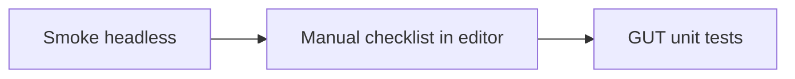

# 游戏运行与异常验证

本页说明如何用命令行与编辑器验证工程能否运行、如何发现崩溃与脚本异常，并记录一次 **Godot 4.6.2** 无头运行的观测结果。

## 1. 环境

- 引擎：Godot 4.6.2（或你本机路径，与 `project.godot` 中 `config/features` 可逐步对齐）。
- 工程根目录：`project.godot` 所在目录。

可选环境变量：

- `GODOT_EXE`：指向 `Godot.exe`（供 [`tools/run_runtime_smoke.ps1`](../tools/run_runtime_smoke.ps1) 使用）。

## 2. 第一层：无头冒烟（自动化）

### 2.1 轻量：仅导入并短时间退出

```powershell
& "D:\program\Godot_v4.6.2-stable_win64.exe" --headless --path "D:\repo\stardew_valley" --quit-after 2
```

或使用仓库脚本（默认 `QuitAfterSeconds=2`）：

```powershell
.\tools\run_runtime_smoke.ps1
```

日志会写入 [`tools/last_smoke_log.txt`](../tools/last_smoke_log.txt)（每次运行覆盖）。

### 2.2 更严：主场景多跑几秒

```powershell
.\tools\run_runtime_smoke.ps1 -QuitAfterSeconds 3
```

### 2.3 严格模式（CI 友好）

若日志中出现 `SCRIPT ERROR`、`Failed to load script`、`Failed to instantiate an autoload`，则以非零退出码失败：

```powershell
.\tools\run_runtime_smoke.ps1 -QuitAfterSeconds 3 -Strict
```

**注意**：进程退出码为 0 **不代表**无错误；部分情况下引擎仍输出错误后继续退出。`-Strict` 以日志内容为准。

## 3. 第二层：手测清单（必须在编辑器中完成）

在 **Debug → Run Project**（或 F5）运行 [`scenes/main.tscn`](../scenes/main.tscn），关注 **Output / Debugger** 面板。

| 步骤 | 关注点 |
|------|--------|
| 启动进入主场景 | 立即报错、缺失资源、贴图/TileMap |
| 移动、与 NPC 对话 | 空引用、对话异常 |
| 打开背包、商店 | UI 异常、`InventoryManager` 等 |
| 钓鱼 / 挖矿 / 砍树 / 浇水 | 活动区、音效、脚本错误 |
| 存档与读档 | `user://game_save.bundle` 是否读写正常 |

建议每次发版或大改动后执行一遍（约 10～15 分钟）。

## 4. 单元测试（GUT，已纳入仓库）

仓库已包含 **[GUT 9.5.0](https://github.com/bitwes/Gut)**（[`addons/gut/`](../addons/gut/)，MIT），并在 [`project.godot`](../project.godot) 的 `[editor_plugins]` 中启用。

- **编辑器**：底部 **Gut** 面板运行 [`tests/unit/`](../tests/unit/) 下测试。
- **命令行（无头）**：使用 [`tools/run_gut.ps1`](../tools/run_gut.ps1)（依赖 `GODOT_EXE` 或默认 `D:\program\Godot_v4.6.2-stable_win64.exe`）：

```powershell
.\tools\run_gut.ps1
```

等价于：

```powershell
& $env:GODOT_EXE --headless --path "D:\repo\stardew_valley" -s res://addons/gut/gut_cmdln.gd -- -gdir=res://tests/unit -ginclude_subdirs -gexit
```

配置见项目根 [`../.gutconfig.json`](../.gutconfig.json)（可被 CLI 参数覆盖）。

**说明**：单元测试通过 **不保证** 主场景可玩；用于逻辑回归。若工程存在全局脚本解析错误，GUT 也可能无法完整加载项目。

## 5. 观测记录（Godot 4.6.2 headless，`--quit-after 3`）

在仓库当前状态下，使用无头模式运行数秒时，控制台曾出现 **大量** 脚本错误与资源问题，包括但不限于：

- **GDScript 类型/解析**：`inventory_manager.gd` 中 `get_item() -> Dictionary` 与 `return null` 不兼容等。
- **`class_name` 与 autoload 同名**：如 `ItemDatabase`、`WeatherSystem` 等报 “hides an autoload singleton”（引擎 4.6 更严格）。
- **`GameZones` 未解析**：依赖 `class_name` 的脚本在部分加载顺序下报错（需与 `scripts/game_zones.gd` 的解析与引擎规则统一修复）。
- **其他**：`weather_overlay.gd`、`game_tilemap.gd`、`main.gd`、`npc.gd` 等解析错误；主场景中资源路径与运行时加载顺序问题。

**结论**：当前应用 **“第一层 + `-Strict`”** 会失败，直至上述问题逐项修复。修复后应重新执行 `.\tools\run_runtime_smoke.ps1 -Strict` 并更新本节记录。

**资源加载说明**：仓库 `.gitignore` 忽略 `*.import`。若在全新克隆下无头运行，可能出现纹理 “No loader found”；在编辑器中打开项目一次会生成导入缓存。CI 可先执行一次编辑器导入或使用带缓存的构建步骤。

## 6. 流程小结



1. 合并前：运行 `run_runtime_smoke.ps1`（必要时加 `-Strict`）。
2. 发版前：手测第三节清单。
3. 逻辑回归：运行 `tools/run_gut.ps1`（需工程能通过 GUT 的项目加载阶段）。
